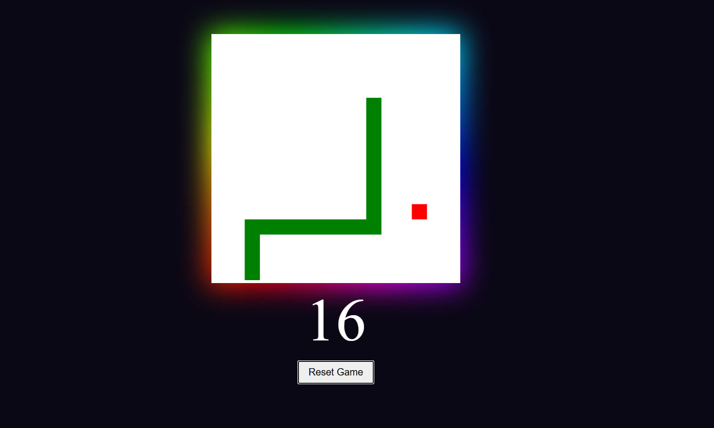

# SNAKE-GAME

A classic Snake game implementation using vanilla JavaScript and HTML5 Canvas.

## Screenshot

## Description

This is a simple web-based Snake game where the player controls a snake to eat food. As the snake eats, it grows longer, and the score increases. The game ends if the snake hits the walls or its own body.

## Features

-   **Classic Gameplay**: Navigate the snake to eat food and grow.
-   **Score Tracking**: Real-time score updates.
-   **Game Over Detection**: Collision detection with walls and the snake's body.
-   **Reset Functionality**: Restart the game without reloading the page.
-   **Responsive Controls**: Use arrow keys for navigation.

## How to Play

1.  Open the `index.html` file in your web browser.
2.  The game starts automatically.
3.  Use the arrow keys to control the snake:
    -   **Arrow Up**: Move Up
    -   **Arrow Down**: Move Down
    -   **Arrow Left**: Move Left
    -   **Arrow Right**: Move Right
4.  Eat the red food blocks to increase your score.
5.  Avoid hitting the walls or the snake's tail.
6.  Click the "Reset" button to start a new game.

## Technologies Used

-   HTML5
-   CSS
-   JavaScript